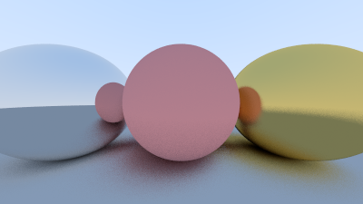
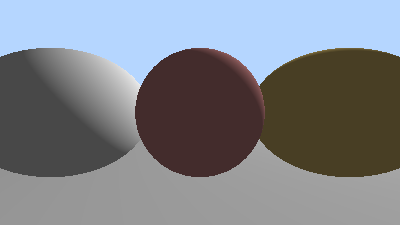

# Bài toán ứng dụng: Cài đặt và So sánh Rasterization vs. Ray Tracing trong thực tế

## 1. Giới thiệu và Mục tiêu

Dự án này là một báo cáo phân tích chi tiết về một chương trình C++ được thiết kế như một **bài toán ứng dụng giáo dục**. Mục tiêu cốt lõi là triển khai và so sánh trực quan hai công nghệ kết xuất đồ họa nền tảng:

* **Rasterization (Đồ họa Raster hóa):** Kỹ thuật đồ họa truyền thống, là nền tảng cho hầu hết các game và ứng dụng 3D thời gian thực trong nhiều thập kỷ.
* **Ray Tracing (Dò tia):** Kỹ thuật mô phỏng đường đi của ánh sáng dựa trên các nguyên tắc vật lý, được coi là tiêu chuẩn vàng để đạt được hình ảnh chân thực trong đồ họa điện ảnh.

Báo cáo đi sâu vào mã nguồn để làm rõ cách mỗi công nghệ được cài đặt và những khác biệt về chất lượng hình ảnh mà chúng tạo ra từ cùng một cảnh 3D.

## 2. Cấu trúc Chương trình

Mã nguồn được tổ chức một cách logic thành 4 phần chính để dễ dàng theo dõi và phân tích:

1.  **Phần 1: Nền tảng Toán học và Cấu trúc Dữ liệu:** Định nghĩa các khối xây dựng cơ bản như vector, tia sáng, và các vật thể hình học.
2.  **Phần 2: Bộ kết xuất Ray Tracing:** Chứa logic của thuật toán Path Tracing để tạo ra ảnh `raytraced_scene.ppm`.
3.  **Phần 3: Bộ kết xuất Rasterization:** Chứa logic của thuật toán Rasterization đơn giản để tạo ra ảnh `rasterized_scene.ppm`.
4.  **Phần 4: Hàm `main` và Dựng cảnh:** Điểm khởi đầu của chương trình, nơi cảnh 3D được khởi tạo và các bộ kết xuất được gọi thực thi.

## 3. Phân tích Kỹ thuật

### 3.1. Nền tảng
* **Cấu trúc `Vec3`** được sử dụng linh hoạt để biểu diễn điểm, vector và màu sắc (RGB)[cite: 103, 104, 105, 106].Việc nạp chồng toán tử giúp mã nguồn trở nên tự nhiên và dễ đọc hơn.
* **Lớp `Hittable`** định nghĩa một giao diện trừu tượng cho các vật thể có thể tương tác với tia sáng thông qua hàm `hit()`.
* **Lớp `Sphere`** là một triển khai cụ thể của `Hittable`, sử dụng công thức toán học để tính toán giao điểm giữa tia và hình cầu.

### 3.2. Bộ kết xuất Ray Tracing (Path Tracing)
* Bộ kết xuất này triển khai thuật toán **Path Tracing**, một dạng nâng cao của Ray Tracing.
* Hàm `ray_color()` là trung tâm của bộ kết xuất. [cite_start]Nó hoạt động theo cơ chế **đệ quy (recursion)**, với mỗi lần gọi hàm tương ứng với một lần ánh sáng nảy bật[cite: 125, 126].Tham số `depth` được dùng để giới hạn số lần nảy bật, tránh vòng lặp vô tận.
* **Mô phỏng vật liệu** được thực hiện dựa trên ID của vật thể, cho phép xử lý các bề mặt khuếch tán (bật nảy ngẫu nhiên) và kim loại (phản xạ gương).
* **Ánh sáng môi trường** được mô phỏng bằng màu nền của bầu trời, đóng vai trò là nguồn sáng gián tiếp cho toàn bộ cảnh.
* **Khử răng cưa (Anti-Aliasing)** được thực hiện bằng cách bắn nhiều tia (100 tia) qua mỗi pixel và lấy trung bình kết quả màu, tạo ra các cạnh vật thể mượt mà hơn.

### 3.3. Bộ kết xuất Rasterization
* Bộ kết xuất này mô phỏng phương pháp Rasterization một cách đơn giản.
* Điểm khác biệt chính là việc sử dụng cơ chế **Z-Buffer giả lập**, trong đó với mỗi pixel, chương trình sẽ xác định vật thể nào nằm gần camera nhất và chỉ hiển thị vật thể đó.
* Hàm `simple_lighting()` triển khai mô hình **chiếu sáng cục bộ (Local Illumination)**[cite: 146]. [cite_start]Nó chỉ tính toán ánh sáng dựa trên vị trí điểm va chạm, pháp tuyến bề mặt và hướng tới một nguồn sáng duy nhất.
* Mô hình này **không có khả năng tạo bóng đổ hoặc phản chiếu** vì nó không nhận biết được sự tồn tại của các vật thể khác trong cảnh và không mô phỏng sự nảy bật của tia sáng.

## 4. Kết luận 

Chương trình đã cài đặt thành công một bài toán ứng dụng cho phép so sánh trực tiếp hai mô hình đồ họa.

* **Rasterization** được minh họa là một phương pháp cục bộ, chỉ có khả năng tính toán ánh sáng trực tiếp, dẫn đến hình ảnh "phẳng" và thiếu các hiệu ứng vật lý quan trọng.
* **Ray Tracing (Path Tracing)** được minh họa là một phương pháp mô phỏng vật lý toàn diện.Bằng cách mô phỏng đường đi và sự nảy bật của ánh sáng, nó tự động tạo ra các hiệu ứng phức tạp như bóng đổ mềm, phản chiếu chính xác, và chiếu sáng gián tiếp, mang lại kết quả chân thực hơn nhiều.

                                                                                   
- Hình 1: Sử dụng RayTracing                                                                                    

- Hình 2: Không sử dụng RayTracing